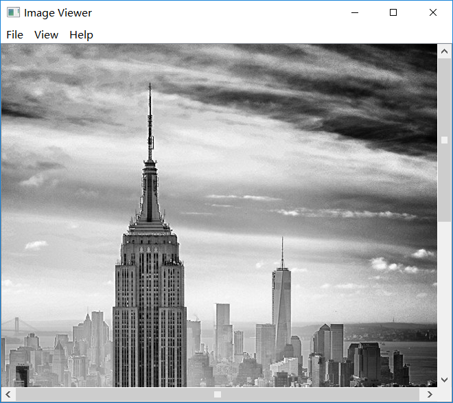

## 图片查看器

该示例显示如何组合QLabel和QScrollArea以显示图像。

QLabel通常用于显示文本，但也可以显示图像。 QScrollArea提供围绕另一个小部件的滚动视图。 如果子窗口小部件超出框架的大小，QScrollArea会自动提供滚动条。

该示例演示了QLabel如何扩展其内容（QLabel :: scaledContents）和QScrollArea自动调整其内容大小的能力（QScrollArea :: widgetResizable），可用于实现缩放和缩放功能。 此外，该示例还显示了如何使用QPainter打印图像。



使用Image Viewer应用程序，用户可以查看他们选择的图像。 “文件”菜单为用户提供了以下可能性：

* Open...  - 打开图像文件
* Print...  - 打印图像
* Exit - 退出应用程序

加载图像后，“View”菜单允许用户：

* Zoom In - 将图像向上缩放25％

* Zoom Out - 缩小图像25％

* Normal Size - 以原始尺寸显示图像

* Fit to Window - 拉伸图像占据整个窗口

  此外，“Help”菜单还为用户提供了有关“图像查看器”示例的信息，以及有关Qt的一般信息。

ImageViewer Class 定义

```c++
class ImageViewer : public QMainWindow
{
    Q_OBJECT

public:
    ImageViewer();

private slots:
    void open();
    void print();
    void zoomIn();
    void zoomOut();
    void normalSize();
    void fitToWindow();
    void about();

private:
    void createActions();
    void createMenus();
    void updateActions();
    void scaleImage(double factor);
    void adjustScrollBar(QScrollBar *scrollBar, double factor);

    QLabel *imageLabel;
    QScrollArea *scrollArea;
    double scaleFactor;

#ifndef QT_NO_PRINTER
    QPrinter printer;
#endif

    QAction *openAct;
    QAction *printAct;
    QAction *exitAct;
    QAction *zoomInAct;
    QAction *zoomOutAct;
    QAction *normalSizeAct;
    QAction *fitToWindowAct;
    QAction *aboutAct;
    QAction *aboutQtAct;

    QMenu *fileMenu;
    QMenu *viewMenu;
    QMenu *helpMenu;
};
```

ImageViewer类继承自QMainWindow。 我们重新实现构造函数，并创建几个私有插槽以方便菜单项。 此外，我们创建了四个私有函数。

在构造ImageViewer小部件时，我们使用createActions（）和createMenus（）。 我们使用updateActions（）函数在加载新图像或切换适合窗口选项时更新菜单条目。 缩放槽使用scaleImage（）来执行缩放。 反过来，scaleImage（）使用adjustScrollBar（）来缩放图像后保留焦点。


在构造函数中，我们首先创建标签和滚动区域。

我们将imageLabel的大小策略设置为忽略，使用户能够在打开“适合窗口”选项时将图像缩放到他们想要的任何大小。 否则，当滚动区域小于标签的最小大小提示时，默认大小polizy（首选）将显示滚动条。

我们确保标签将缩放其内容以填充所有可用空间，以使图像在缩放时正确缩放。 如果我们省略了设置imageLabel的scaledContents属性，则放大会放大QLabel，但会将像素图保留为原始大小，从而暴露QLabel的背景。

我们将imageLabel设置为滚动区域的子窗口小部件，并使scrollArea成为QMainWindow的中心窗口小部件。 最后，我们创建相关的操作和菜单，并自定义ImageViewer的外观。


在open（）槽中，我们向用户显示一个文件对话框。创建QFileDialog的最简单方法是使用静态便捷函数。 QFileDialog :: getOpenFileName（）返回用户选择的现有文件。如果用户按下Cancel，QFileDialog将返回一个空字符串。

除非文件名是空字符串，否则我们通过构造试图从文件加载图像的QImage来检查文件的格式是否是图像格式。如果构造函数返回null图像，我们使用QMessageBox来警告用户。

QMessageBox类提供带有短消息，图标和一些按钮的模态对话框。与QFileDialog一样，创建QMessageBox的最简单方法是使用其静态便捷函数。 QMessageBox提供了沿两个轴排列的一系列不同消息：严重性（问题，信息，警告和严重）和复杂性（必要响应按钮的数量）。在该特定示例中，具有OK按钮（默认）的信息消息就足够了，因为该消息是正常操作的一部分。


